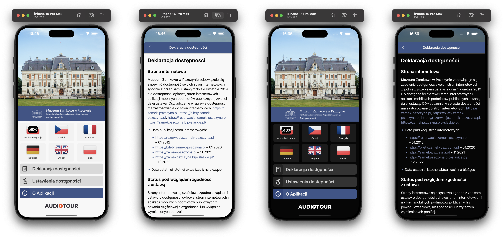

# Zadanie testowe Android

kontakt:   
mail: kamil@audiotour.pl  
tel: +48 7979 539 74

English version below ⬇️

## Opis zadania

Do ekranu wyboru języka należy dodać przycisk "Deklaracja dostępności" otwierający modal z wyrenderowanym tekstem sformatowanym w markdown pobranym z endpointu API. Aby uniknąć przeskakiwania layoutu, wyświetlenie ekranu wyboru języka powinno zostać opóźnione do momentu uzyskania odpowiedzi z serwera. W przypadku otrzymania pustego obiektu, lub obiektu z wartością null przy polu "accessibility_declaration" pryzcisk nie powinien być wyświetlany. Przy opisie przycisku można wykorzystać dowloną ikonę.

## Wymagania

- przycisk korzysta z kolorów już istniejących w projekcie
- pojawianie się/ukrywanie się przycisku powinno odbywać się przed pierwszym renderowaniem ekranu
- tekst markdown odpowienio renderuje nagłówki, listy, linki
- linki w tekście są klikalne i używają odpowiedniego dla motywu koloru
- obsługa dark mode
- obramiwanie okna powinno być takie samo jak w innych modalach na tym ekranie
- tekst deklaracji powinien używać systemowej bezszerywowej czcionki

### Endpoint:

    http://164.90.180.184:8000/api/v3/app_info?appID=134

parametry:

- `appID`: ID aplikacji. Przykładowo wartości 1 i 134 zwracają prawidłową deklarację dostępności.

### Zrzuty ekranu wersji iOS

# Android Test Task

## Task Description

An "accessibility declaration" button and screen need to be added to the language selection screen. The screen should display rendered markdown text obtained from an API response. To avoid layout shift, the screen should await the server response and only present itself once the visibility of the button has been determined. In case the API response is empty or the "accessibility_declaration" field is null, the button shouldn't be visible. You are free to use any icon to accompany the button.

## Requirements

- the button should use colors already present in the project.
- showing/hiding of the button should occur before content painting.
- markdown should be rendered properly, including headers, lists, and links.
- links contained within the declaration body should be tappable and use a theme color.
- dark mode support.
- window chrome should match other modals accessible from the language select screen.
- the declaration text should be formatted using a default system sans-serif font.

### Endpoint:

    http://164.90.180.184:8000/api/v3/app_info?appID=134

Params:

- `appID`: application ID; values of 1 and 134 should return a valid markdown response.

### iOS Version Screenshots

